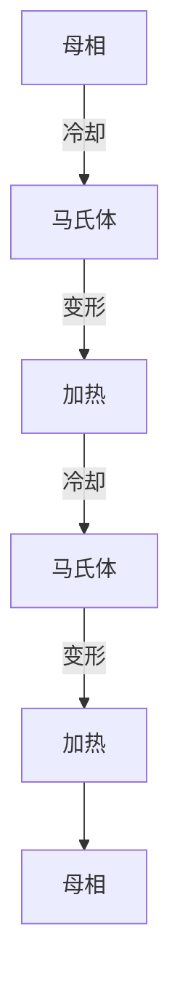

# 9 特殊铜合金 $^{①}$

# 9.1 艺术用铜合金

# 9.1.1 概述

我国是最早使用艺术铜合金的国家，早在殷商时代就大规模地使用锡青铜制作各种各样装饰性很强、艺术价值极高的器皿、雕塑。用铜合金制作艺术品具有古朴庄重或华丽典雅的特点，历来深受各国人民的青睐。随着合金设计、熔铸加工、仿古做旧、表面处理等相关技术的进步，艺术铜合金门类有了很大的发展。

艺术用铜合金是指那些用于制造鼎、镜、鼓、香炉、佛像、雕塑等艺术品、装饰品和乐器、兵器或钱币等的铜合金。与普通铜合金不同的是它们对色泽、耐蚀性、磨削加工性或音质、响度有特殊要求。和其他铜合金一样，艺术用铜合金按照工艺方法可以分为铸造合金和变形合金两大类。而按照合金成分则可以分为紫铜、黄铜、青铜和白铜。

紫铜具有古铜色，朴实、大方、庄严，韧性好，焊接性能优良，多用作雕塑、人物雕像。黄铜有华贵艳丽的金黄色，常用作饰品，富丽堂皇、高贵典雅。青铜具有青靛色，耐蚀性好，用作器皿，稳重耐久。而白铜则具有银白色光泽，多用作餐具、乐器、纪念品，显得高洁清新。

# 9.1.2 艺术用紫铜

艺术用紫铜主要有二号铜(T2)、三号铜(T3)和磷脱氧铜(TP2)三种。它们的成分、物理化学性能、工艺性能见第5章。常用作铸造小型雕像、景泰蓝和镶嵌装饰品的胎坯、钱币和器皿。紫铜板可作铜版画、大型浮雕等。

# 9.1.3 艺术用黄铜

艺术黄铜色如黄金，常作金箔和金粉的替代品，得到广泛使用。变形普通黄铜以薄板、箔、管、线的形态用于艺术品，它们的成分、性能见第6章。艺术用铸造黄铜的牌号和化学成分列于表9-1。含锌20%的黄铜经过研磨会显现出美丽的晶粒，在艺术品加工中称此工艺为“点金”。

表 9-1 铸造艺术黄铜的牌号和化学成分(质量分数) (%)

<table><tr><td>合金</td><td>Cu</td><td>Zn</td><td>Sn</td><td>Al</td><td>Pb</td><td>Mn</td><td>色泽</td></tr><tr><td>ZCuZn6Al0.5P</td><td>余量</td><td>4~8</td><td></td><td>0.4~0.7</td><td>0.1~0.3/P</td><td></td><td rowspan="9">金黄</td></tr><tr><td>ZCuZn12</td><td>87~89</td><td>余量</td><td></td><td></td><td></td><td></td></tr><tr><td>ZCuZn12Al</td><td>87~89</td><td>余量</td><td></td><td>1.0~2.0</td><td></td><td></td></tr><tr><td>ZCuZn24Sn1Pb3</td><td>70~74</td><td>余量</td><td>0.5~1.5</td><td></td><td>1.5~3.5</td><td></td></tr><tr><td>ZCuZn27Mn3Pb2Sn</td><td>余量</td><td>25~30</td><td>0.3~0.5</td><td></td><td>2.0~3.0</td><td>2.5~4.0</td></tr><tr><td>ZCuZn30</td><td>68.5~71.5</td><td>余量</td><td></td><td></td><td></td><td></td></tr><tr><td>ZCuZn33Mn2Pb</td><td>余量</td><td>32~34</td><td>0.3~0.5</td><td></td><td>0.5~1.0</td><td>1.5~2.7</td></tr><tr><td>ZCuZn35Sn1Al</td><td>64~66</td><td>余量</td><td>0.5~1.5</td><td>0.2~0.4</td><td></td><td></td></tr><tr><td>ZCuZn38Sn1Pb1Al</td><td>58~64</td><td>余量</td><td>0.5~1.5</td><td>0.5~1.0</td><td>0.8~1.5</td><td></td></tr><tr><td>ZCuZn38Al1Mn</td><td>57~62</td><td>余量</td><td></td><td>0.25~0.5</td><td></td><td>0.1~1.0</td><td rowspan="2">银</td></tr><tr><td>ZCuZn20Mn20Sn1Al</td><td>55~61</td><td>17~23</td><td>0.5~2.5</td><td>0.25~3.0</td><td></td><td>0.1~2.17</td></tr></table>

# 9.1.4 艺术用青铜

青铜种类很多,除做高强导电材料、弹性导电材料、高强耐热材料、高强耐磨材料(第7章)外,还大量用于艺术造型中。

# 9.1.4.1 锡青铜

艺术青铜中最主要的是铸造锡青铜，牌号和化学成分见表9-2。艺术青铜的锡含量一般小于 $20\%$ ，其组织为 $\alpha + (\alpha + \delta)$ 相。 $\alpha$ 相是锡在铜中的固溶体，面心立方晶格。 $\delta$ 相为复杂六方晶格的 $Cu_{31}Sn_{8}$ 金属间化合物, 其共析分解十分缓慢, 硬而脆, 故能提高强度和耐磨性。砂型铸造时如果 Sn 含量为 7%、金属型铸造时如果 Sn 含量为 5%, 就会出现 δ 相。锡含量过多, 则导致着色困难。而含 5% Sn 以下时为单一 α 相, 易于着色。锡青铜结晶温度范围宽, 易产生疏松和补缩困难。锡青铜耐蚀性优良, 表面生成 $SnO_{2}$ 薄膜, 能起很好的保护作用。同时, α 和 δ 相的电位相近, 微电池作用很微弱。合金元素对锡青铜的影响见表 9-3。

表 9-2 艺术锡青铜的化学成分(质量分数) (%)

<table><tr><td>合金</td><td>Sn</td><td>Al</td><td>Zn</td><td>Pb</td><td>Mn</td><td>Cu</td></tr><tr><td>ZCuSn2Zn3</td><td>1.8~2.2</td><td></td><td>2.5~3.5</td><td></td><td></td><td>余量</td></tr><tr><td>ZCuSn3Al2</td><td>2.5~3.5</td><td>1.5~3.5</td><td></td><td></td><td></td><td>余量</td></tr><tr><td>ZCuSn12Mn1</td><td>10~15</td><td></td><td>0.15~0.25</td><td>0.2~0.3</td><td>1.0~1.25</td><td>余量</td></tr><tr><td>ZCuSn18</td><td>17~19</td><td></td><td></td><td></td><td>1.0~2.0</td><td>余量</td></tr></table>

表 9-3 合金元素对锡青铜的影响

<table><tr><td>元素</td><td>作用</td></tr><tr><td>Zn</td><td>溶于α固溶体,缩小凝固温度范围,提高流动性,能还原 $SnO_{2}$ ,净化合金。含量超过5%后难以生成温雅的绿膜,容易风化,有时还会使铸文、图案细部模糊不清</td></tr><tr><td>Al</td><td>溶于α固溶体,其氧化物会使熔体的流动性降低。含量达到0.5%时就会使材料由暗红色变为金黄色</td></tr><tr><td>Pb</td><td>不溶于合金中,以质点分布,可改善合金的耐磨性和切削性能,提高合金的耐水性。Pb的衰减能力很大。含量过高时会形成重力偏析</td></tr><tr><td>P</td><td>磷在锡青铜中的溶解度很小,磷过量会析出硬而脆的 $Cu_{3}P$ ,常与α、δ相形成二元或三元共晶。P降低青铜的着色性能,但有显著的脱氧作用</td></tr><tr><td>Fe</td><td>常以游离态分布在合金中,有利于着色</td></tr><tr><td>As</td><td>在锡青铜煮沸着色时效果明显,但含量以不超过0.45%为宜</td></tr><tr><td>Si</td><td>合金中有Si会由暗红转为茶色或紫葡萄色</td></tr></table>

A 像用锡青铜

(佛像)的化学成分见表9-4。

锡含量一般不超过 10%。古代著名铜像

表 9-4 古代著名铜像(佛像)的化学成分(质量分数) (%)

<table><tr><td>名称</td><td>Cu</td><td>Sn</td><td>Fe</td><td>Ni</td><td>Zn</td><td>Pb</td></tr><tr><td>希腊古铜像</td><td>84~88</td><td>9.0~14.3</td><td>0.4~1.2</td><td>0.34</td><td></td><td></td></tr><tr><td>罗马古铜像</td><td>72~80</td><td>7.3~9.0</td><td>0.3~1.2</td><td>0.35</td><td></td><td>10~19</td></tr><tr><td>日本奈良大佛</td><td>91~95</td><td>1.46~2.46</td><td>0.95~1.43</td><td>0.28</td><td></td><td></td></tr><tr><td>中国天坛大佛</td><td>86~89.2</td><td>7.5~9.0</td><td></td><td></td><td>3~8</td><td></td></tr></table>

B 钟用锡青铜

锡含量一般在 13%\~25% 之间, 含量偏低

时(5.5%\~12.5%), 基音强度弱, 其他分音的强度也弱, 而第二分音特别强, 音色单调、尖锐刺耳。含量过高(超过25%)时冲击韧性太差，不堪撞击。通常钟用锡青铜不宜加Pb，因为Pb的衰减能性大、抑振。但是，我国铜钟中往往加有0.6%\~1.95%的Pb，并发现当Sn在13%\~14%时，少量的Pb对基频影响很小，而且会适当改善音色。我国古铜钟的化学成分见表9-5。

表 9-5 我国古代铜钟的  
化学成分(质量分数) (%)

<table><tr><td>钟名及文献</td><td>Cu</td><td>Sn</td><td>Pb</td><td>其他</td></tr><tr><td>《考工记》钟鼎之齐</td><td>83.4</td><td>16.6</td><td></td><td></td></tr><tr><td>永乐大钟</td><td>80.54</td><td>16.4</td><td>1.12</td><td></td></tr><tr><td>《天工开物》钟条</td><td>93</td><td>8.5</td><td></td><td>Au、Ag少量</td></tr><tr><td>《明实录》朝钟制度</td><td>81.2</td><td>5.4</td><td></td><td>Fe:13.4%Au、Ag少量</td></tr></table>

# C 镜用锡青铜

镜用锡青铜的 Sn 含量很高,有的高达 30%,基本上是单一的 δ 相,非常脆。高锡青铜有很高的硬度,研磨后可获得极光滑的表面。我国古代铜镜的化学成分见表 9-6。

表 9-6 我国古代铜镜的  
化学成分(质量分数) (%)

<table><tr><td>年代</td><td>Cu</td><td>Sn</td><td>Pb</td><td>Fe</td><td>其他</td></tr><tr><td rowspan="4">战国以前</td><td>66~71</td><td>19~21</td><td>2~3</td><td></td><td></td></tr><tr><td>66.33</td><td>21.99</td><td>3.36</td><td></td><td></td></tr><tr><td>71.44</td><td>19.62</td><td>2.69</td><td></td><td></td></tr><tr><td>74</td><td>25</td><td>1</td><td></td><td></td></tr><tr><td rowspan="7">汉魏时代</td><td>73</td><td>22</td><td>5</td><td></td><td></td></tr><tr><td>70</td><td>23.25</td><td>5.18</td><td></td><td>1.0</td></tr><tr><td>68.82</td><td>24.65</td><td>5.25</td><td></td><td></td></tr><tr><td>69.24</td><td>22.94</td><td>6.48</td><td></td><td></td></tr><tr><td>67.82</td><td>22.35</td><td>6.09</td><td></td><td>4.15</td></tr><tr><td>70.50</td><td>26.97</td><td>1.65</td><td></td><td>0.88</td></tr><tr><td>72.64</td><td>24.16</td><td>2.06</td><td></td><td>1.14</td></tr><tr><td rowspan="3">隋唐时代</td><td>69.55</td><td>22.48</td><td>5.86</td><td></td><td></td></tr><tr><td>68.95</td><td>23.65</td><td>6.08</td><td></td><td></td></tr><tr><td>70</td><td>25</td><td>5</td><td></td><td></td></tr><tr><td rowspan="2">宋代以后</td><td>69</td><td>12</td><td>14</td><td>5</td><td></td></tr><tr><td>69</td><td>8</td><td>15</td><td>6</td><td></td></tr></table>

# D 鼓用锡青铜

鼓用锡青铜和其他青铜器一样, 是 Cu、Sn、Pb三元合金,我国古代典型铜鼓的化学成分见表9-7。

表 9-7 我国古代铜鼓的  
化学成分(质量分数) (%)

<table><tr><td>出土地点</td><td>Cu</td><td>Sn</td><td>Pb</td></tr><tr><td>石家坝</td><td>87.95~95.63</td><td>4.64~6.87</td><td></td></tr><tr><td>石寨山</td><td>77.45~85.43</td><td></td><td>0.37~4.00</td></tr><tr><td>冷水冲</td><td>62.43~74.03</td><td>6.88~14.96</td><td>14.50~27.41</td></tr><tr><td>遵义</td><td>66.90~84.06</td><td>6.33~7.10</td><td>7.30~19.50</td></tr><tr><td>北流</td><td>61.78~70.45</td><td>6.16~14.24</td><td>9.44~23.0</td></tr><tr><td>灵山</td><td>60.12~70.56</td><td>8.84~12.80</td><td>7.60~19.76</td></tr><tr><td>麻江</td><td>63.85~82.73</td><td>9.22~13.16</td><td>0.73~6.90</td></tr><tr><td>西盟</td><td>70.12</td><td>2.22</td><td>23.36</td></tr><tr><td>容县</td><td>82.05</td><td>7.36</td><td>5.8</td></tr></table>

# E 币用锡青铜

币用锡青铜也是 Cu、Sn、Pb 三元合金，但成分不稳定。明、清以后多用紫铜和黄铜。我国古币的化学成分见表 9-8。

表 9-8 我国古币的化学成分(质量分数)(%)

<table><tr><td>年代</td><td>名称</td><td>Cu</td><td>Sn</td><td>Pb</td><td>Zn</td><td>Fe</td></tr><tr><td rowspan="3">战国</td><td>货币</td><td>70.42</td><td>9.92</td><td>19.30</td><td></td><td></td></tr><tr><td>齐刀</td><td>55.10</td><td>4.29</td><td>38.60</td><td></td><td>1.00</td></tr><tr><td>明刀</td><td>45.05</td><td>5.90</td><td>45.82</td><td></td><td>2.00</td></tr><tr><td rowspan="6">新莽</td><td>大泉五十</td><td>86.72</td><td>3.41</td><td>4.33</td><td>4.11</td><td>0.13</td></tr><tr><td>货泉</td><td>77.53</td><td>4.55</td><td>11.99</td><td>2.03</td><td>1.46</td></tr><tr><td>小泉直一</td><td>89.27</td><td>6.39</td><td>0.37</td><td>2.15</td><td>1.50</td></tr><tr><td>大布黄千</td><td>89.55</td><td>4.71</td><td>0.62</td><td>1.48</td><td>3.56</td></tr><tr><td>货币</td><td>83.41</td><td>6.86</td><td>6.54</td><td>0.84</td><td>0.47</td></tr><tr><td>契刀五百</td><td>81.13</td><td>6.96</td><td>6.17</td><td>1.01</td><td>1.39</td></tr><tr><td rowspan="4">西汉</td><td>吕后八铢</td><td>61.23</td><td>9.83</td><td>25.49</td><td>1.55</td><td>1.54</td></tr><tr><td>文帝四铢</td><td>92.66</td><td>0.27</td><td>0.43</td><td>2.82</td><td>0.28</td></tr><tr><td>文帝四铢</td><td>70.77</td><td>8.19</td><td>12.50</td><td>2.66</td><td>2.80</td></tr><tr><td>文帝四铢</td><td>93.97</td><td>0.16</td><td>0.57</td><td>3.85</td><td>0.05</td></tr></table>

# 9.1.4.2 铝青铜

铝青铜与锡青铜相比有更多的优点:材料表面有一层可以自愈的 $Al_{2}O_{3}$ 保护膜,在大气和海洋环境中有很高的耐蚀性能。强度高、抗冲击,而且价格便宜。常温下铝在铜中的极限溶解度为 9.4%。合金中 Al 含量超过固溶极限后会出现 $\gamma$ 相,它硬而脆,且会在 565℃以下温度发生缓冷脆裂,导致铸件裂纹。而加入 Mn、Fe、Pb、Ni 可以抑制这种现象。铸造铝青铜的化学成分见表 9-9。

表 9-9 铸造铝青铜的化学成分(质量分数) (%)

<table><tr><td>合金</td><td>Al</td><td>Fe</td><td>Mn</td><td>Cu</td></tr><tr><td>ZCuAl9Mn2</td><td>8.0~10.0</td><td></td><td>1.5~2.5</td><td>余量</td></tr><tr><td>ZCuAl9Fe3</td><td>8.0~10.0</td><td>2.0~4.0</td><td></td><td>余量</td></tr><tr><td>ZCuAl10Mn2Fe3</td><td>9.0~11.0</td><td>2.0~4.0</td><td>1.0~2.0</td><td>余量</td></tr></table>

# 9.1.4.3 现代仿金材料

近年来，仿金材料(亦称亚金合金)有重要发展。主要是在铝青铜中添加少量锌、镍、锡和稀有元素，充分利用铝青铜的耐蚀、抗冲击性，进一步改进铝青铜的色泽和加工性能，降低成本。其中“18合金”和造币材料QA15-5-1颇为著名。“18合金”添加有铟(In)，色泽酷似18K黄金，并有极高的耐蚀性、优良的冷热加工性能和焊接性能，成为巨型佛像、城市纪念性雕塑的首选材料。“18合金”的成分和性能见表9-10和表9-11。铝青铜QA15-5-1具有良好的加工性能和耐蚀、耐磨性能，色泽金黄，被选作冲制硬币的材料，其主要成分见表9-10。

表 9-10 新型仿金材料的主要  
成分(质量分数) (%)

<table><tr><td>合金</td><td>Cu</td><td>Al</td><td>Sn</td><td>Zn</td><td>Ni</td><td>In</td></tr><tr><td>18合金</td><td>余量</td><td>3.0~5.0</td><td></td><td></td><td>1.5~2.5</td><td>0.2~1.0</td></tr><tr><td>QAl5-5-1</td><td>余量</td><td>4.0~6.0</td><td>0.5~1.5</td><td>4.0~6.0</td><td></td><td></td></tr></table>

表 9-11 18 合金的性能

<table><tr><td>名称</td><td>数值</td></tr><tr><td>密度/ $kg \cdot m^{-3}$ </td><td>8130</td></tr><tr><td>固相线温度/°C</td><td>1046</td></tr><tr><td>液相线温度/°C</td><td>1065</td></tr><tr><td>比热容/ $J \cdot kg^{-1} \cdot ^{\circ}C^{-1}$ </td><td>380</td></tr><tr><td>线膨胀系数/ $^{\circ}C^{-1}$ </td><td> $18.5 \times 10^{-6}$ </td></tr><tr><td>抗拉强度/MPa</td><td>230~300</td></tr><tr><td>伸长率/%</td><td>24~50</td></tr><tr><td>硬度BRS</td><td>73</td></tr><tr><td>3.5%NaCl25°C全浸的腐蚀速率/ $g \cdot cm^{-2} \cdot a^{-1}$ </td><td>7.26(锡青铜为9.32)</td></tr></table>

# 9.1.5 艺术用白铜

白铜(见第8章)是Cu-Ni系合金,一般含5%\~30% Ni,色泽为银白色,光泽艳丽。含20%左右的白铜常用来制造钱币和奖杯、奖牌,是白银的理想替代品。这些合金硬度较高,刻印时磨耗少,易于加工。加锌白铜最接近银色,具有很好的加工性能和耐蚀性,是选制餐具、乐器和装饰品的理想材料。常用艺术白铜的成分见表9-12。

表 9-12 铸造艺术白铜的化学成分(质量分数) (%)

<table><tr><td>合金</td><td>Cu</td><td>Ni</td><td>Zn</td><td>Sn</td><td>Pb</td><td>Fe</td><td>Mn</td><td>Si</td></tr><tr><td>ZCuNi12Zn20Pb10</td><td>余量</td><td>11~14</td><td>17~25</td><td>1.5~3.0</td><td>8~11</td><td>1.5</td><td>0.5</td><td>0.15</td></tr><tr><td>ZCuNi16Zn16Sn3Pb5</td><td>58~61</td><td>15.5~17</td><td>余量</td><td>2.5~3.5</td><td>4.5~5.5</td><td>1.5</td><td>0.5</td><td></td></tr><tr><td>ZCuNi20Zn5Sn4Pb4</td><td>余量</td><td>9~21.5</td><td>3~9</td><td>3.5~4.5</td><td>3.0~5.0</td><td>1.5</td><td>1.5</td><td>0.15</td></tr><tr><td>ZCuNi25Zn2Sn5Pb2</td><td>余量</td><td>24~27</td><td>1~4</td><td>4.5~5.5</td><td>1.0~2.5</td><td>1.5</td><td>1.5</td><td>0.15</td></tr></table>

# 9.2 铜基形状记忆合金

# 9.2.1 概述

# 9.2.1.1 形状记忆合金的概念

给已适当变形的材料以温度变化,它能自动作功而回复变形前形状的效应称“形状记忆效应”(Shape Memory Effect),具有形状记忆效应的合金称为形状记忆合金(Shape Memory

Alloy)。

早在 20 世纪 40 年代人们就对形状记忆效应进行了研究,但直至 60 年代,美国海军武器研究所首次将形状记忆合金应用于飞机油压管接头后才引起人们广泛关注。此后,经过近 40 多年的研究与开发,形状记忆合金才开始走向实用化阶段,广泛应用于航空、航天、能源、汽车工业、电子、医疗、机械、建筑、服装、玩具等各个领域。当前,形状记忆合金无论在材料的研究上,还是在制备工艺及元件的应用上都在不断的开拓和发展。其中,铜基形状记忆合金是目前发现的形状记忆合金中的一个主要类别,它具有形状记忆、超弹性、高阻尼和良好的导电性四大功能,且生产工艺简单、成本低廉和性能优良。其记忆性能仅次于 Ni-Ti 系合金,相变点可在 -100\~300℃ 范围内调节,在要求反复使用次数不太高、条件不太苛刻情况下,应用前景非常广泛。

# 9.2.1.2 形状记忆效应与伪弹性

形状记忆效应有三种形式。

第一种称为单向形状记忆效应,即将母相冷却或加应力,使之发生马氏体相变,然后使马氏体发生变形,改变其形状,再重新加热到 $A_{s}$ 以上,马氏体发生逆转变,温度升至 $A_{f}$ 点,马氏体完全消失,材料完全恢复母相形状。一般没有特殊说明,形状记忆效应都是指这种单向形状记忆效应,见图9-1a。

有些形状记忆合金在加热发生马氏体逆转变时,对母相有记忆效应;当从母相再次冷却为马氏体时,自觉回复原马氏体的形状,这种现象称为双向形状记忆效应,又称可逆形状记忆效应,见图9-1b。

第三种情况是在 Ti-Ni 合金系中发现的, 在冷热循环过程中, 形状回复到与母相完全相反的形状, 称为全方位形状记忆效应, 见图 9-1c。

flowchart

图 9-1 形状记忆效应的三种形状

冷却时，在无应力条件下，马氏体在 $M_{\mathrm{s}}$ 开始形成。若施加应力，马氏体可以在 $M_{\mathrm{s}}$ 以上温度形成，这种马氏体称为应力诱发马氏体(Stress-Induced Martensite,简称SIM)。它的相变驱动力不是热能而是机械能。当材料处于 $M_{\mathrm{s}} \sim M_{\mathrm{d}}$ 温度范围时发生变形，就会产生伪弹性，类似橡胶。 $M_{\mathrm{d}}$ 是应力诱发马氏体相变的终了温度。在 $M_{\mathrm{s}} \sim M_{\mathrm{d}}$ 之间外加应力，可以保持马氏体稳定，但应力一旦消除，马氏体就变得不稳定。图9-2表示超弹性的应力一应变曲线。曲线上部平台对应于应力作用下形成的马氏体，而曲线下部平台对应于应力消除时的马氏体可逆转变。它们的可恢复应变量达到 $10\%$ 以上。伪弹性也可称之为机械形状记忆效应。

伪弹性有三个应用特点:(1)其可恢复应变量能达到10%以上,几乎高出通常材料弹性应变两个数量级;(2)合金显示恒弹性,在应力恒定时会产生较大的应变;(3)在未发生应力诱发相变前,合金就具有2%的弹性应变,这样做成的弹簧也比一般弹簧性能好得多。

line

| 应变/% | 母相 → SIM (MPa) | 母相 ← SIM (MPa) |
| ------ | --------------- | --------------- |
| 0      | 0               | 0               |
| 2      | ~95             | ~75             |
| 4      | ~98             | ~78             |
| 6      | ~100            | ~80             |
| 8      | ~102            | ~85             |
| 10     | ~105            | ~90             |

图9-2 Cu-Zn合金应力诱发马氏体相变呈现的伪弹性行为

# 9.2.2 铜基形状记忆合金种类

现已发现具有形状记忆效应的铜基形状记忆合金体系有: Cu - Zn, Cu-Zn-Al, Cu-Zn-Sn, Cu-Zn-Ni, Cu-Zn-Si, Cu-Zn-Ga, Cu-Al, Cu-Al-Ni, Cu-Al-Mn, Cu-Al-Si, Cu-Al-Nb, Cu-Al-Be 等。

# 9.2.3 部分铜基形状记忆合金的性能

部分铜基形状记忆合金的性能见表 9-13。

表 9-13 Cu-Zn-Al 和 Cu-Al-Ni 记忆合金相关性能

<table><tr><td>名称</td><td>单位</td><td>Cu-Zn-Al</td><td>Cu-Al-Ni</td></tr><tr><td>熔点</td><td>°C</td><td>950~1020</td><td>1000~1050</td></tr><tr><td>密度</td><td>kg/m3</td><td>7800~8000</td><td>7100~7200</td></tr><tr><td>电阻率</td><td>μΩ·m</td><td>0.07~0.12</td><td>0.1~0.14</td></tr><tr><td>导热率</td><td>W/(m·°C)</td><td>120(20°C)</td><td>75</td></tr><tr><td>热膨胀系数</td><td></td><td>16~18×10-6(马氏体)</td><td>16~18×10-6(马氏体)</td></tr><tr><td>比热容</td><td>J/(kg·°C)</td><td>390</td><td>400~480</td></tr><tr><td>相变热</td><td>J/kg</td><td>7000~9000</td><td>7000~9000</td></tr><tr><td>弹性模量</td><td>GPa</td><td>70~100</td><td>80~100</td></tr><tr><td>屈服强度</td><td>MPa</td><td>150~300</td><td>150~300</td></tr><tr><td>抗拉强度(马氏体)</td><td>MPa</td><td>700~800</td><td>1000~1200</td></tr><tr><td>伸长率(马氏体)</td><td>%</td><td>10~15</td><td>8~10</td></tr><tr><td>疲劳极限</td><td>MPa</td><td>270</td><td>350</td></tr><tr><td>晶粒大小</td><td>μm</td><td>50~100</td><td>25~60</td></tr><tr><td>转变温度</td><td>°C</td><td>-200~+170</td><td>-200~+170</td></tr><tr><td>滞后大小(As-Af)</td><td>°C</td><td>10~20</td><td>10~20</td></tr><tr><td>最大单向形状记忆(应变)</td><td>%</td><td>5</td><td>6</td></tr><tr><td>最大双向形状记忆(应变)</td><td>%</td><td></td><td></td></tr><tr><td>N=102</td><td></td><td>1</td><td>1.2</td></tr><tr><td>N=105</td><td></td><td>0.8</td><td>0.8</td></tr><tr><td>N=107</td><td></td><td>0.5</td><td>0.5</td></tr><tr><td>上限加热温度(1h)</td><td>°C</td><td>160~200</td><td>300</td></tr><tr><td>阻尼比SDC</td><td>%</td><td>30</td><td>10</td></tr><tr><td>最大伪弹性应变(单晶)</td><td>%</td><td>10</td><td>10</td></tr><tr><td>最大伪弹性应变(多晶)</td><td>%</td><td>2</td><td>2</td></tr><tr><td>回复应力</td><td>MPa</td><td>200</td><td></td></tr></table>

# 9.2.4 铜基形状记忆合金的工艺性能

# 9.2.4.1 熔炼与铸造工艺

合金通常采用中频感应电炉熔炼。对 Cu-Al-Ni、Cu-Al、Cu-Al-Si 系合金可采用真空熔炼或气体保护熔炼，对 Cu-Zn、Cu-Zn-Al、Cu-Zn-Sn、CuAlMn 等含 Zn、Mn 元素的合金不能采用真空熔炼，在 $N_{2}$ 或 Ar 保护性气氛下进行熔炼。上述合金在大气中熔炼时可采用煅烧木炭做覆盖，造渣剂采用 $Na_{3}AlF_{6}$ 与 $CaF_{2}$ ，浇注温度 1280～1360℃。

# 9.2.4.2 成形性能

合金热加工性能良好,可进行挤压、热轧、锻造等加工,热加工温度为800\~860℃。合金冷加工性能较差,可在双相区淬火后进行冷加工,冷加工后,合金需进行固溶处理,固溶温度

800\~850℃，介质淬火或空冷。

# 9.2.5 铜基形状记忆合金的应用

# 9.2.5.1 自适应紧固件、连接件和密封垫

自动紧固件,即热收缩的管接头,使用方法是把制作好的记忆合金管接头(一般内径比被连接的管子外径小4%左右)放在低温 $T<M_{s}$ 下扩大管径,然后套在要被连接的管子头上。当管接头渐渐升温超过 $A_{s}$ 温度时,它将收缩到原来的形状,从而将被连接的管子牢固地连接起来(图9-3)。如果这类管子在 $M_{s}$ 温度以上工作的话,它们的结合是极为牢固的。

例: 用 Cu-18.4Al-8.7Mn-3.4Zn-0.1Zr (质量分数) 记忆合金管接头, 进行管道连接, 该管接头技术性能指标可达:

相变滞后宽度 >90℃

贮存温度 <50℃

记忆应变 >3.5%

拉脱力 >350 kg( $\phi8$ 管)

气密性 在振动及 5 MPa 静压下，
5 min 压力不降,无泄露

text_image

加热

图 9-3 记忆管接头工作示意图

# 9.2.5.2 热敏控制器

SMAs 是一种热敏材料。它可以按环境条件选取适当的合金，控制其 $M_{s}$ 、 $A_{f}$ 及变温范围，借助 SMAs 的形状记忆达到控温目的。很显然，它与常见的光电、压电、热电等感知器的原理不同，后者是在感知信号后输出电信号（或其他信号），仅具有“感知”职能。SMAs 不仅可作为感知器，更重要的是可兼负驱动作用，主要应用在以下诸方面。

图 9-4 所示为电加热水壶的手柄控制器，柄内装有一只 SMAs 制作的弹簧。水开后，蒸汽吹至 SMAs 元件上发生马氏体向奥氏体相变，弹簧伸长带动按钮推开电触头，达到自动切断电源的目的。同双金属片比较，SMAs 元件机构简单，双金属片挠曲量相对 SMAs 要小得多。一块长 50 mm、厚 1 mm 的双金属片在 100℃ 温差产生的挠度仅 2～4 mm，而在相同条件下 SMAs 却可得到 20 mm 挠度，因而用后者更为灵敏可靠。

# 9.2.5.3 自动调节装置

图 9-5 所示为美国和日本生产的育苗室、温室等天窗自动控制器, 其中用 Cu 基 SMAs 制作的弹簧充当温度传感器和动力机构。在预定的温度,通过 SMAs 弹簧的伸缩来开启和关闭窗户。铜基形状记忆合金已巧妙地应用于汽车的汽化器上。由 CuZnAl 合金制成一个简单的喷油嘴,插入 Stromberg 型汽化器中,喷嘴的尺寸可以根据燃料的温度高低而改变大小,从而正确控制燃料的流量来补偿燃料黏度的变化所造成的损耗。图 9-6 示出这种喷嘴的设计及测得的一些参量曲线。值得注意的是,在燃料温度较高时,这种喷嘴排出的 CO 气体减少,这样可防止对环境的污染。类似的还有热机冷却风扇启闭器、散热器阀门、空调风向调节器、电冰箱自动开关、化学反应温度自动控制器、干燥装置开关、对流电子炉灶中气流调节器等等。

text_image

速动簧片
开启钮
偏置簧
按钮
记忆元件
喷汽口
电触头

图 9-4 铜基 SMAs 制作的电加热水壶控制器  

natural_image

Close-up of industrial machinery components with no visible text or symbols

图 9-5 铜基形状记忆合金弹簧制作的天窗自动控制器

line

| 燃料温度 (°C) | 喷嘴收缩 (2.54 μm)/μm | 排气CO/% |
| -------------- | --------------------- | -------- |
| 20             | 0.5                   | 1.5      |
| 30             | 0.8                   | 2.0      |
| 40             | 1.2                   | 3.0      |
| 50             | 1.8                   | 5.0      |
| 60             | 2.5                   | 7.0      |
| 70             | 3.0                   | 9.0      |

图 9-6 铜基形状记忆合金汽化器喷油及其参量曲线

# 9.2.5.4 色调记忆配件

含 12%\~15% Al(质量分数)和 1%\~5% Ni(质量分数)的铜合金是具有热弹性马氏体相变的色调记忆元件，在 200\~400℃范围内具有相变特性温度。通过相变，合金的色调从红色变为金黄色。随着合金中 Al 含量的改变，相变特性温度最低可降到 -200℃。因此，通过加入适当 Al 和外加负荷，相变特性温度可在 -200\~400℃间任意调整。这样就可以用色调记忆特性开发温度指示器和在交变应力作用下的指示器。

# 9.2.5.5 弹性减振复合材料

继电器是控制电路中的重要元件,广泛应用于国防及民用工业中。

电子器材专家认为真正理想的继电器弹簧片材料应具有以下四个基本特点：

(1) 优良的导电能力；  
(2) 高弹性；  
(3) 优良的阻尼性能, 即高减振性;   
(4) 良好的耐热能力。

铍青铜是一种高导电、高弹性的材料，而铜基记忆合金在马氏体状态及相变过程中具有优良的减振能力,选用铍青铜作为高导电、高弹性组元与高减振的铜基形状记忆合金进行爆炸复合,可制成一种新型弹性减振复合材料。

材料减振性能的主要衡量指标就是材料的内耗值。对利用 CuAlNiMnTi( $M_{s}=150^{\circ}\mathrm{C}$ ) 与 QBe2 爆炸复合的材料的内耗值进行测试, 结果见图 9-7 和图 9-8。

scatter

| 振幅 (a) | 内耗值 (试样1) | 内耗值 (试样2) |
|----------|----------------|----------------|
| 0        | 17.0           | 2.8            |
| 5×10⁻⁴   | 19.0           | 2.7            |
| 10×10⁻⁴  | 18.0           | 2.7            |
| 20×10⁻⁴  | 25.0           | 2.5            |

图 9-7 常温下复合板材、QBe2 内耗与应变振幅的关系  
$a$ —复合板材； $b$ —QBe2

图 9-7 所示为复合板材、QBe2 常温下内耗与应变振幅的关系。复合板材的内耗值较之 QBe2 增加了近一个数量级，而且具明显的振幅效应。

图 9-8 所示为复合板材在不同的振动频率下内耗随温度的变化关系。复合板材在 $M_{s}$ 点附近及以下很宽的温度范围内均显示出优异的减振性,特别是在相变温度附近,内耗值达最大。振动频率在实验范围内对复合板材的内耗特性影响不大。

bar_line

| t/℃ | 内耗值 (×10⁻³) | 系数 |
|------|----------------|------|
| -50  | 35             | 0.6  |
| 0    | 35             | 0.6  |
| 50   | 35             | 0.6  |
| 100  | 35             | 0.6  |
| 150  | 35             | 0.6  |
| 200  | 35             | 0.6  |
| 250  | 35             | 0.6  |

bar_line

| t /°C | 内耗值 (×10⁻³) | 系数 |
|-------|----------------|------|
| -50   | ~20            | 0.0  |
| 0     | ~18            | 0.0  |
| 50    | ~22            | 0.0  |
| 100   | ~25            | 0.0  |
| 150   | ~15            | -0.2 |
| 200   | ~5             | -0.6 |
| 250   | ~3             | -0.6 |

bar_line

| t/℃ | 内耗值 (×10⁻³) | 系数 |
|------|-----------------|------|
| -50  | ~16             | ~0.2 |
| 0    | ~16             | ~0.2 |
| 50   | ~16             | ~0.2 |
| 100  | ~18             | ~0.2 |
| 150  | ~10             | ~0.4 |
| 200  | ~3              | ~0.6 |
| 250  | ~3              | ~0.6 |

图 9-8 复合板材在不同频率下内耗随温度变化

# 第3篇

# 铜及铜合金熔炼与铸造技术

# 10 铜合金熔炼过程中的物理化学

行为 263

10.1 熔炼过程的物理基础 …… 263  
10.2 熔炼过程中的化学反应 …… 266  
10.3 熔体中的气体 273  
10.4 合金化 276

# 11 铜及铜合金熔炼技术 …… 279

11.1 原料及其制备 279  
11.2 配料 288  
11.3 熔炼气氛及其选择 …… 291  
11.4 熔炼及熔炼损失与污染 …… 295   
11.5 除气精炼 299   
11.6 脱氧精炼 301   
11.7 炉前化学成分调整及温度控制 304  
11.8 熔炼过程优化 …… 306

# 12 铜及铜合金熔炼工艺 …… 308

12.1 纯铜的熔炼 308   
12.2 黄铜的熔炼 314  
12.3 青铜的熔炼 320  
12.4 白铜的熔炼 324

# 13 铜合金熔炼设备及炉衬技术 …… 326

13.1 工频有铁心感应电炉 …… 326  
13.2 无铁心感应电炉 …… 337  
13.3 真空感应电炉 344  
13.4 电渣重熔炉 348  
13.5 反射炉 350  
13.6 竖式炉 356

# 14 铜合金铸造性质及铸造原理 …… 359

14.1 熔体的浇注 359   
14.2 熔体保护与铸锭润滑 …… 364   
14.3 结晶器内金属液面的控制…… 367  
14.4 铸锭的凝固 369   
14.5 凝固过程中气体的析出 …… 374  
14.6 结晶及结晶组织 375  
14.7 收缩、铸造应力与裂纹 …… 381

# 15 铜合金半连续及连续铸造技术 … 388

15.1 直接水冷铸造 388  
15.2 非直接水冷铸造 392  
15.3 振动铸造与间歇铸造 …… 395  
15.4 热顶及热模铸造 399  
15.5 电磁铸造 403  
15.6 棒坯和管坯水平连续铸造……406  
15.7 带坯的水平连续铸造 409  
15.8 立式连续铸造 416

# 16 铜合金半连续与连续铸造生产…… 418

16.1 纯铜铸锭生产 418  
16.2 黄铜铸锭生产 422  
16.3 青铜铸锭生产 426  
16.4 白铜铸锭生产 432  
16.5 铸锭质量及缺陷分析 …… 434

# 17 铜合金铸造设备及工具 441

17.1 立式半连续铸造设备 …… 441  
17.2 立式连续铸造设备 446  
17.3 水平连续铸造设备 448  
17.4 结晶器及其振动和间歇铸造装置 452  
17.5 铸锭加工设备及运输工具…… 464

# 18 铜及铜合金铁模和水冷模铸造 …… 471

18.1 铁模和水冷模铸造技术 …… 471  
18.2 铸模涂料及其制备 …… 472  
18.3 铸铁模及水冷模 474   
18.4 铁模和水冷模铸造工艺 …… 477   
18.5 真空吸铸 481

# 19 铜线坯连铸技术 …… 483

19.1 上引式连铸 483  
19.2 轮带式连铸 485  
19.3 钢带式连铸 487   
19.4 浸渍成型铸造 489